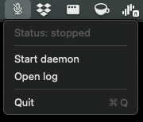
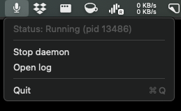

# minidic

A tiny **vibe coding** project for voice dictation on macOS.

## What this project is

- Built as a personal, experimental tool with fast iteration.
- Intended to **run locally** on one machine.
- **Not planned for packaging/distribution** as a polished application.

## Technique overview

`minidic` captures microphone audio, normalizes it to 16 kHz, and runs local speech-to-text with streaming-style decoding.

High-level pipeline:

1. Capture mic audio with `sounddevice`
2. Resample to 16 kHz with `soxr` (when needed)
3. Transcribe with `parakeet-mlx` on-device (Apple Silicon / MLX stack)
4. Optionally clean filler words (`um`, `uh`, etc.)
5. Inject text into the active app on macOS

The daemon mode is hotkey-driven (press to start/stop recording), and it lazily loads/unloads the model to keep resource usage low when idle.

## Models used

Default ASR model:

- `mlx-community/parakeet-tdt-0.6b-v3`

Model runtime:

- `parakeet-mlx`
- `mlx`

The model is downloaded on first use (and then reused from local cache).

## Install

```bash
uv sync
uv run minidic
```

## Usage

1. Start menu bar app:

   ```bash
   uv run minidic menubar
   ```

   
   

2. In the menu bar app, click **Start daemon** (or **Stop daemon** to stop it).

3. Press `F5` to toggle start/stop dictation.

Other useful commands:

```bash
uv run minidic transcribe path/to/file.wav
```

## Notes

- macOS permissions (microphone/accessibility) are required for full functionality.
- Recordings and logs are stored under `~/.minidic/`.
