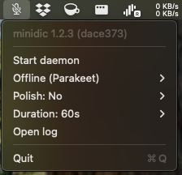
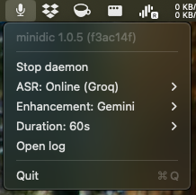

# minidic

A tiny macOS dictation tool for fast voice input from the menu bar or terminal.

## Install

`minidic` is published on PyPI for macOS users.

```bash
uv tool install minidic
```

To upgrade an existing install:

```bash
uv tool upgrade minidic
```

The first run will download `mlx-community/parakeet-tdt-0.6b-v3`.

`uv tool` installs `minidic` to `~/.local/bin/minidic`.
Make sure `~/.local/bin` is on your `PATH`.

## Usage

On first use, macOS will prompt for the permissions required by `minidic`. In general, you need to grant these permissions to the terminal app you use to run the commands:

- **Microphone** — needed to capture live audio for dictation
- **Accessibility** — needed to inject the transcribed text into the active app and handle global hotkeys in menu bar mode

To use `--gemini`, set `GEMINI_API_KEY` in your environment before running `minidic`.

### Console

Run an interactive dictation session in the terminal. This records from your microphone, transcribes locally, and inserts the final text into the active app.

```bash
minidic console
minidic console --gemini
```

### Transcribe

Transcribe an existing audio file from disk instead of recording live microphone input.

```bash
minidic transcribe path/to/file.wav
minidic transcribe --gemini path/to/file.wav
```

### Menubar

Run `minidic` as a menu bar app with a background daemon and global `F5` hotkey for push-to-toggle dictation.

```bash
minidic menubar
```




1. Start the menu bar app.
2. Optionally choose a max recording length from **Duration** in the menu.
3. Click **Start daemon** (or **Stop daemon** to stop it).
4. Press `F5` to toggle start/stop dictation (captured globally; other apps will not receive `F5` while daemon is running).

## Technique overview

`minidic` captures microphone audio, normalizes it to 16 kHz, and runs local speech-to-text with streaming-style decoding.

### Models used

- **ASR model:** `parakeet-mlx` for on-device audio transcription on Apple Silicon / MLX
- **LLM model:** `gemini-3.1-flash-lite-preview` for optional transcript cleanup (thinking disabled)

### High-level pipeline

1. Capture mic audio with `sounddevice`
2. Resample to 16 kHz with `soxr` (when needed)
3. Transcribe with `parakeet-mlx` on-device
4. Smooth transcription by default with local regex cleanup (remove filler words like `um`, `uh`, etc.)
5. Further smooth with Gemini when `GEMINI_API_KEY` is set and Gemini mode is enabled (via `--gemini` for `console`/`transcribe`, or via the menu bar toggle)
6. Inject text into the active app on macOS

The daemon mode is hotkey-driven and lazily loads/unloads the model to reduce idle resource usage.

### Directory structure

```text
~/.minidic/
└── recordings/             # saved WAV recordings captured during dictation/transcription

~/.local/state/minidic/
├── config.json            # persisted runtime config such as Gemini and duration settings
├── daemon.log             # daemon logs
├── daemon.pid             # daemon process ID
├── daemon.state           # current daemon state: idle, recording, transcribing
├── menubar.log            # menu bar app logs
└── menubar.pid            # menu bar process ID
```
